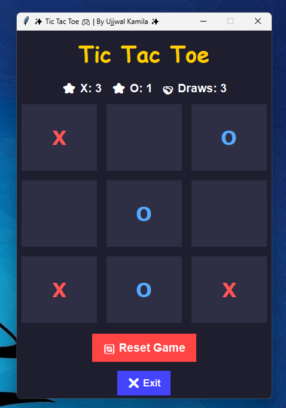

# 🎮✨ Tic Tac Toe Game Using Python

A simple Tic Tac Toe (X-O) Game implemented in Python with:

  - 🖥 Console-based version (`main.py`)
  - 🖱 Graphical User Interface (GUI) version (`gui.py`) using Tkinter

Developed by Ujjwal Kamila 

-----

## 📂 Project Structure

```
Tic Tac Toe Game/
│── main.py        # Console-based Tic Tac Toe
│── gui.py         # GUI-based Tic Tac Toe (Tkinter)
└── .gitignore     # Ignore cache and virtual env files
```

-----

## 🚀 Features

  - ✅ Play Tic Tac Toe in two modes – Console & GUI
  - ✅ GUI with scoreboard (Tracks wins for X, O, and Draws)
  - ✅ Error handling for invalid inputs (console version)
  - ✅ Clean and colorful UI design (GUI version)
  - ✅ Replay / Reset option without restarting the program
  - ✅ Cross-platform – Works on Windows, Linux, and macOS

-----

## 🛠 Requirements

Make sure you have:

  - Python 3.8+ installed
  - Tkinter (comes pre-installed with Python)

-----

## ▶️ How to Run

### 1️⃣ Run the Console Version

```bash
python main.py
```

  - Enter numbers (0–8) to mark positions.
  - The first player is X, the second player is O.
  - The game announces the Winner or if it's a Draw.

### 2️⃣ Run the GUI Version

```bash
python gui.py
```

  - Click buttons to place X and O.
  - The scoreboard updates automatically.
  - Reset the board anytime.
  - Use the Exit button to quit the game.

-----

## 🎨 Screenshots

### Console Version

```
 ___________
|   |   |   |
| X | O | 2 |
|___|___|___|
|   |   |   |
| 3 | X | 5 |
|___|___|___|
|   |   |   |
| 6 | 7 | O |
|___|___|___|
```

### 🎨 GUI Version

✨ Modern Tkinter UI with buttons, colors, and a scoreboard (X, O, Draws).




-----

## ⚡ Error Handling

  - In the console version, entering invalid inputs (like alphabets, out-of-range numbers, or occupied cells) will not crash the game.
  - In the GUI version, clicks on already occupied cells are ignored safely.

-----


## 📝 License

This project is open-source and free to use for learning. 🚀


---

<h3 align="center">
  <b>Happy Coding 👨‍💻 | Keep Practicing 💡</b>
</h3>

---

<h3 align="center">
  <b>Let's Connect!! </b>
  
</h3>

<p align="center">
  <a href="https://ujjwal-kamila.vercel.app/"></a>
  <a href="https://www.linkedin.com/in/ujjwal-kamila-8a12a4262/"></a>
  <a href="https://leetcode.com/ujjwalkamila86/"></a>
</p>